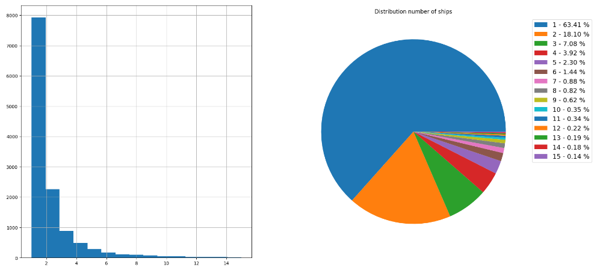
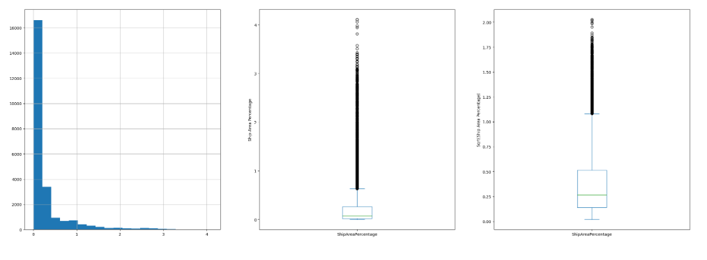
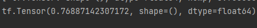

## Airbus Ship Detection Challenge
Requirements:
1) Python 3.11
2) pip install -r requirements.txt

Author: kriuchkvskyi.vlad@gmail.com

### Project structure

| model_inference.py # Inference .py file of nn with example in it\
| classification_train.py # Train .py file for classification model\
| segmentation_train.py # Train .py file for segmentation model\
| Data analysis.ipynb # Analysis of data\
| model_structures # Folder with model structures for usage in production\
| model_weights # Saved model weights for usage in production\
| train_images # Folder with images for training\
| inference_drafts # Folder with .ipynb notebooks that were used during experiments\
| helpers # Folder with helping scripts or csv files

### Solution description

#### Getting dataset
Airbus detection challenge dataset consists of 31.41 gb of data ( images and csv files ).
There are 192556 masks in train dataset. Thus, my first task was to get a small part of dataset.
The reason of this was due to my restrictions in computing capabilities.

I've made simple notebook file for retrieving 25k images from original dataset ( 12.5 k with ships and 12.5 k files 
without ships ). You can find this script in `helpers/Creating dataset.ipynb`

Here you can find zip file with this dataset: https://drive.google.com/file/d/19YxF_zeuBHogYQxmO1Xs9TWoAHX6_ADI/view?usp=sharing

#### Analysing data

For analysing data I've took dataset that was generated on the previous step. 

Dataset consists of:
- 12.5k no ship images
- 12.5k ships images
- 36495 masks for ships images

Data is balanced on ships/no ships classes. However, if we'll look at the images with ships and plot the number 
of ships on the image distribution it is clear that there are much more photos with only one ship.
It could lead to some troubles if we take the original task ( e.g. mark every ship on image into unique class ), but I 
do not really think it would cause some troubles for overall segmentation. 

Also, it is obvious that ships takes very small percentage of image. It means that we cannot crop photos very much. So I've
only resized pictures to 384 on 384 pixel size.

### Training models
Overall, usually my decisions were made due to the fact that I do not have much computer powers for training big Neural Networks.

My plan was to split task on two parts :\
Classification of ship/no ship images\
Segmentation on images that contains ships

Starting of classification task, the model I've used was VGG16 with freezed layers and single dense layer at the end for results.
Surprisingly, it gave me a pretty decent result showing 90 % accuracy. I've also tried much heavier solutions as training 
ResNet50 with freezed layers and (128 * 64 * 2) Dense layers, but it didn't give me results, as well as VGG16 with more Dense layers. 

You can see how Vgg16 was trained in `inference_drafts\vgg16 classifier`\
You can see bad ResNet50 attempt in `inference_drafts\resnet50 classifier`

I was training models on 348 * 348 resized pictures. Vgg16 was trained for ~100 epochs ( notebook shows another thing 
because I've restarted some training strings a couple of time ). For VGG16 I have not used any data augmentation. ( For 
ResNet50 I have so maybe this is the reason why it failed so much ).

For segmentation model I've used a bit simplified version of Unet to lower the amount of parameters used. On test 
set 

the dice score on 160 test images ( random images from train file ) for overall model is

(You can test this via `helpers/dice_estimator.py` file)

the dice score of UNET model on only ships images is 0.7, unfortunately I did not save the last training file I did in 
google colab so it is not displayed in jupyter notebook(.Also to note, I've trained model for 110 epochs and really feel like it could 
have done more with more epochs and batch size.

I've also tried to train resnet50 encoder + unet decoder model, but for some reason it failed completely
and unfortunately I do not really have enough time to investigate it until the deadline.

### My errors and thoughts

Overall, I haven't used data augmentations due to small computer power capabilities. I think that reducing percentage
of blue color on image could lead to some better results of classifier especially. Also, I have not really
used validation dataset for dice score, it was more like test dataset but I do not think model could overfit to it as images
were different on every epoch. I've also seen in discussions the proposal of classifying images at the end after segmantation
based on classifier + segmentator results, wanted to try it but couldn't due to resource limit. It is also interesting to investigate of why resnet50 model failed
in both classification and segmentation tasks. Im sure it is probably some incorrect data preparation or smth.

My classification model is also need to be trained better. 0.9 accuracy means that there are 10% of classification wrongs and it impacts the whole dice score very much in case of False Negatives ( images with ships classified as no ship ) samples. 

And sometimes model is struggling with small ships images. So a key here is finding a good data preparation pipeline and not just resizing.

